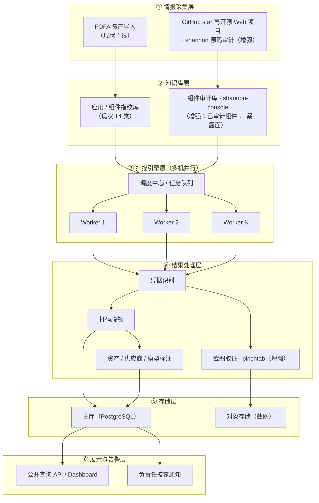
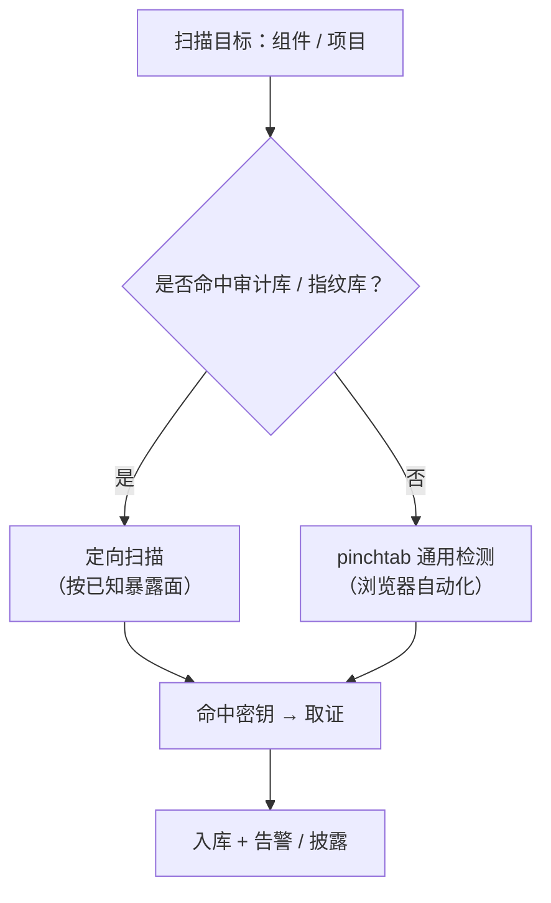

# 秘钥守望者 · 系统架构设计

> 版本：v1.2（2026-08-21）
> 本文档描述「秘钥守望者（SecretWatcher）」的系统架构，分为「现状架构」「目标架构（增强）」「技术组件」与「迁移路径」四部分。

## 1. 定位与设计原则

秘钥守望者是公益 AI API 凭据暴露发现与负责任披露项目。系统从合规测绘数据与公开源码中取得资产线索，主动读取公开可访问的页面与同源构建产物，发现可能暴露的大模型凭据，并以最小化方式保存证据、通知资产所有者。

架构设计遵循以下原则（详见 README 公益原则与数据保护）：

- 不使用、不验证泄露密钥，不调用任何第三方 API。
- 完整密钥不落库、不进日志、不对外展示；仅保存脱敏片段与不可逆指纹。
- 最少采集、最短留存、默认脱敏。
- 优先通知与修复，而非展示、炒作或排名。

## 2. 现状架构与痛点

### 2.1 现状架构

现有 MVP 已完成：FOFA 资产导入 → 应用指纹识别（14 类）→ 主动扫描入口 HTML → 同源 JS / chunk / sourcemap 遍历 → 凭据上下文识别 → 脱敏指纹落库（末 8 位 + HMAC-SHA256）→ 公开查询 API。

### 2.2 现状痛点（重构动机）

| # | 痛点 | 影响 |
| --- | --- | --- |
| 1 | 资产来源单一，仅依赖 FOFA 测绘被动发现 | 覆盖窄，漏掉大量未纳入测绘的暴露面 |
| 2 | 主动扫描拿不到有效内容（首批 30 资产 0 有效 JS 响应） | 真实凭据发现数为 0，闭环未打通 |
| 3 | SQLite 单调度节点，三台机器未形成并行集群 | 无法横向扩展，扫描吞吐受限 |
| 4 | 构建产物解析不完整（Webpack / Vite / Next.js 等缺失） | 大量前端构建产物无法覆盖 |
| 5 | 无截图取证、无资产/供应商/模型元信息标注 | 证据链不完整，披露时说服力不足 |
| 6 | 披露、认领、通知、复测、申诉流程未实现 | 无法形成「发现 → 处置」的公益闭环 |

## 3. 目标架构（增强方案）

在保留 FOFA 测绘主线的基础上，新增 **GitHub star 数高的开源 Web 项目**作为第二情报源，用 **shannon** 做源码审计产出暴露面；建设由 **shannon-console** 承载的组件审计库；扫描引擎升级为「定向扫描 + pinchtab 通用检测」双引擎并支持多机并行；结果处理层补全截图取证与资产/供应商/模型标注。

### 3.1 各层职责与增强点

| 层 | 职责 | 现状 / 增强 |
| --- | --- | --- |
| ① 情报采集层 | FOFA 资产导入（主线）+ GitHub star 高开源 Web 项目采集与 shannon 源码审计 | FOFA 已实现；GitHub + shannon 为增强 |
| ② 知识库层 | 应用指纹库 + 组件审计库（shannon-console 承载，已审计组件 ↔ 暴露面） | 指纹库已实现；审计库为增强 |
| ③ 扫描引擎层 | 调度中心 + 任务队列，多 Worker 并行；定向扫描 / pinchtab 通用检测双引擎 | 单节点已实现；并行 + 双引擎为增强 |
| ④ 结果处理层 | 凭据识别、打码脱敏、资产/供应商/模型标注、截图取证（pinchtab 浏览器自动化） | 识别 + 脱敏已实现；标注 + 截图为增强 |
| ⑤ 存储层 | PostgreSQL 主库 + 对象存储（截图） | SQLite 已实现；迁移 + 对象存储为增强 |
| ⑥ 展示与告警层 | 公开查询 API / Dashboard + 负责任披露通知 | 查询 API 已实现；通知为增强 |

## 4. 扫描引擎决策流程（双引擎路由）

核心设计是「先查审计库 / 指纹库，命中走定向、未命中走 pinchtab 通用检测」：

- **命中 → 定向扫描**：按该组件已知的暴露面（入口路径、构建产物、配置字段）精准探测，更快、误报更低。
- **未命中 → pinchtab 通用检测**：用浏览器自动化桥接动态访问页面，识别公开暴露的密钥；同时产出 key 出现位置的截图作为取证。

## 5. 技术组件清单

| 组件 | 来源 | 技术栈 | 在架构中的角色 |
| --- | --- | --- | --- |
| shannon | fork 自 `KeygraphHQ/shannon` | TypeScript | 源码审计引擎：分析源码、识别攻击向量与暴露面 |
| shannon-console | 自建 | Python | 攻击面情报平台：扫描数据入库 / 组件知识库复用 / 多生态指纹识别 |
| pinchtab | fork 自 `pinchtab/pinchtab` | — | 浏览器自动化 + 多实例编排：通用 key 检测、截图取证、多机并行 |
| FOFA API | 第三方测绘 | — | 互联网资产线索（现有主线） |

## 6. 迁移路径

| 阶段 | 目标 | 关键动作 |
| --- | --- | --- |
| 1 | 情报源增强 | 接入 GitHub star 高开源 Web 项目采集 + shannon 源码审计，沉淀组件审计库（shannon-console） |
| 2 | 双引擎扫描 | 命中审计库 → 定向扫描；未命中 → pinchtab 通用检测 |
| 3 | 多机并行 | SQLite → PostgreSQL，引入任务队列 + 租约 + 幂等键 + 心跳 + 域名限速；pinchtab 多实例编排 |
| 4 | 取证增强 | pinchtab 浏览器截图 + 对象存储 + 资产 / 供应商 / 模型标注 |
| 5 | 披露闭环 | 域名 / 企业邮箱验证、通知模板、复测、误报申诉、删除请求 |

## 7. 待确认 / 待办

- GitHub 源码审计路径的合规边界与采集频率（star 阈值、语言/生态范围、限速）。
- pinchtab 与 shannon 的具体集成方式（审计结果如何喂给扫描引擎与审计库）。
- 截图取证的技术选型（无头浏览器、存储与访问控制、过期策略）。

> 架构图使用 Mermaid 绘制，GitHub 原生渲染。如需导出 SVG/PNG 版本可另行生成。
