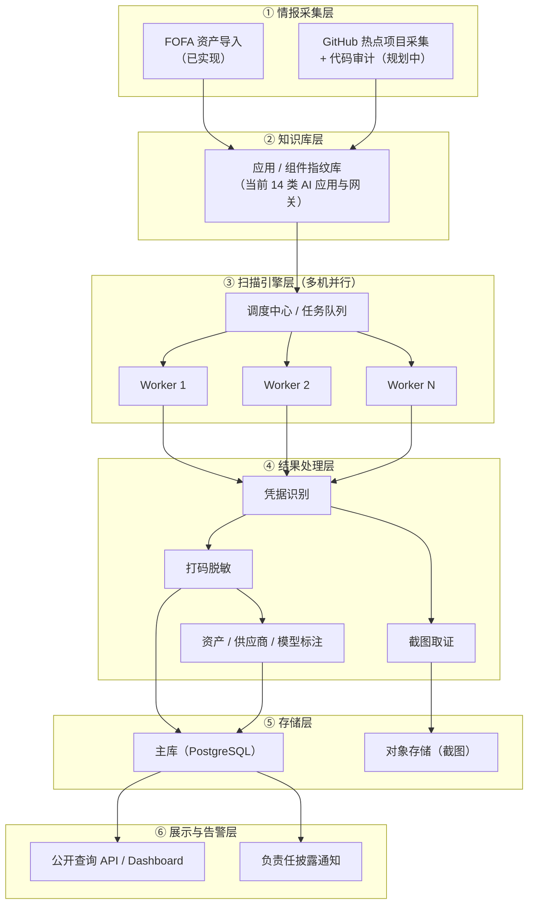
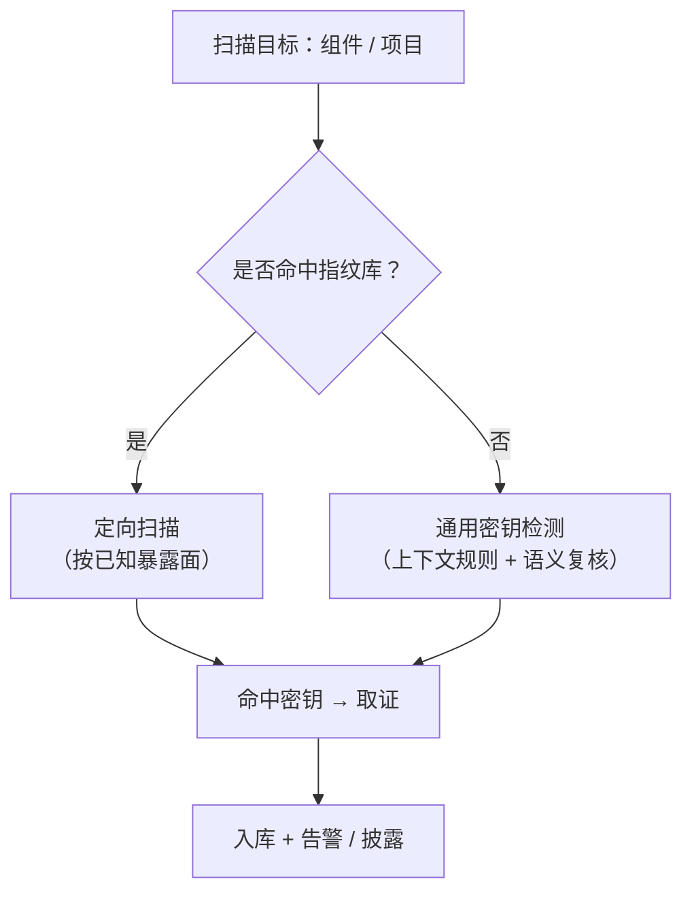

# 秘钥守望者 · 系统架构设计

> 版本：v1.0（2026-08-21）
> 本文档描述「秘钥守望者（SecretWatcher）」的整体系统架构与扫描引擎决策逻辑，并与当前实现状态对齐。

## 1. 定位与设计原则

秘钥守望者是公益 AI API 凭据暴露发现与负责任披露项目。系统从合规测绘数据与公开源码中取得资产线索，主动读取公开可访问的页面与同源构建产物，发现可能暴露的大模型凭据，并以最小化方式保存证据、通知资产所有者。

架构设计遵循以下原则（详见 README 公益原则与数据保护）：

- 不使用、不验证泄露密钥，不调用任何第三方 API。
- 完整密钥不落库、不进日志、不对外展示；仅保存脱敏片段与不可逆指纹。
- 最少采集、最短留存、默认脱敏。
- 优先通知与修复，而非展示、炒作或排名。

## 2. 总体架构分层

系统自采集到处置分为六层：

### 各层职责

| 层 | 职责 | 当前状态 |
| --- | --- | --- |
| ① 情报采集层 | 获取资产线索：FOFA 资产导入（每小时）；GitHub 热点项目采集与代码审计，产出组件暴露面 | FOFA 已实现，GitHub 路径规划中 |
| ② 知识库层 | 应用/组件指纹库，记录已识别 AI 应用与网关的暴露面特征，供扫描引擎匹配 | 已实现（14 类指纹） |
| ③ 扫描引擎层 | 调度中心 + 任务队列，分发到多台 Worker 并行扫描；双引擎路由（定向 / 通用） | 单节点已实现，多机集群待建 |
| ④ 结果处理层 | 凭据识别、打码脱敏、资产/供应商/模型标注、截图取证 | 识别 + 脱敏已实现，截图待做 |
| ⑤ 存储层 | PostgreSQL 主库（现 SQLite）+ 对象存储（截图证据） | SQLite 已实现，迁移待做 |
| ⑥ 展示与告警层 | 公开查询 API / Dashboard + 负责任披露通知 | 查询 API 已实现，通知待做 |

## 3. 扫描引擎决策流程（双引擎路由）

核心设计是「先查指纹库，命中走定向、未命中走通用」：

- **命中指纹库 → 定向扫描**：按该应用已知的暴露面（入口路径、构建产物、配置字段）精准探测，更快、误报更低。
- **未命中 → 通用检测**：使用上下文规则 + DeepSeek 语义复核做通用凭据识别（当前实现）；设计讨论中称其为 "picntab"，具体指代哪类引擎待确认。

## 4. 关键数据流

1. FOFA 资产导入 → 资产去重入库（`assets`）。
2. 指纹识别 → 判定应用类型（`detections`）。
3. 主动扫描：入口 HTML → 同源 `.js` / `.mjs` / chunk / `.map` → 构建产物解析（`asset_scans`）。
4. 凭据上下文识别 → 提供商 / 模型归属 → 脱敏（末 8 位 + HMAC-SHA256 指纹，`credential_findings`）。
5. 取证：截图（待做）+ 资产 / 供应商 / 模型元信息标注。
6. 入库 + 查询 + 负责任披露（`/api/public/*`）。

## 5. 与当前实现的映射

| 设计能力 | 现状 | 下一步 |
| --- | --- | --- |
| 资产发现与应用识别 | 已实现：FOFA 导入 + 14 类指纹 | GitHub 源码审计路径 |
| JavaScript 暴露发现框架 | 已实现：同源资源图 + sourcemap | Webpack / Vite / Next.js 构建产物解析 |
| 凭据识别与数据最小化 | 已实现：上下文规则 + 脱敏指纹 | 增加通用检测引擎覆盖 |
| 多机并行扫描 | 单节点已实现 | PostgreSQL + 任务队列 + 租约 + 幂等键 + 心跳 |
| 截图取证 | 未实现 | 无头浏览器截图 + 对象存储 |
| 负责任披露 | 末四位查询已实现 | 域名 / 企业邮箱验证、通知模板、复测、申诉 |

## 6. 待确认 / 待办

- "picntab" 具体指代哪类检测引擎（若指 gitleaks / truffleHog / detect-secrets 等可补充说明）。
- GitHub 源码审计路径是否纳入一期范围。
- 截图取证的技术选型（无头浏览器、存储与访问控制）。

> 架构图使用 Mermaid 绘制，GitHub 原生渲染。如需导出 SVG/PNG 版本可另行生成。
