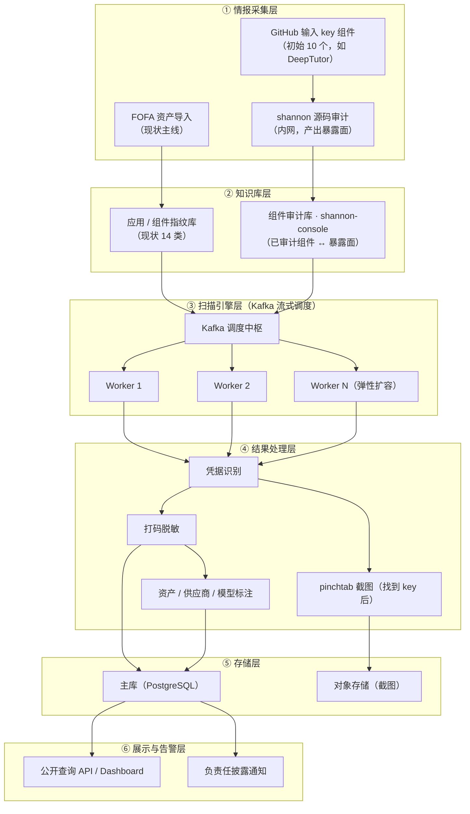
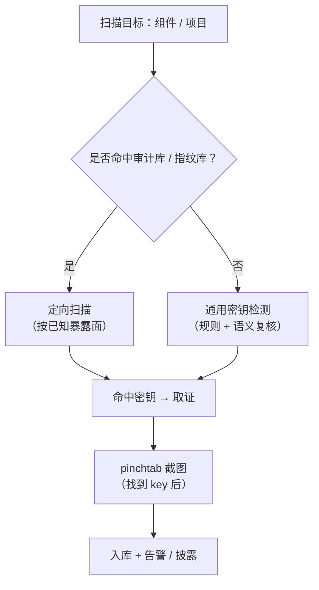
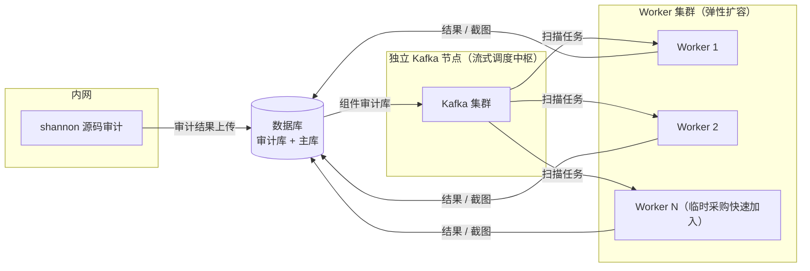

# 秘钥守望者 · 系统架构设计

> 版本：v1.4（2026-08-21）
> 本文档描述「秘钥守望者（SecretWatcher）」的系统架构，分为「现状架构」「目标架构（增强）」「技术组件」「部署拓扑」与「迁移路径」。

## 1. 定位与设计原则

秘钥守望者是公益 AI API 凭据暴露发现与负责任披露项目。系统从合规测绘数据与公开源码中取得资产线索，主动读取公开可访问的页面与同源构建产物，发现可能暴露的大模型凭据，并以最小化方式保存证据、通知资产所有者。

架构设计遵循以下原则（详见 README 公益原则与数据保护）：

- 不使用、不验证泄露密钥，不调用任何第三方 API。
- 完整密钥不落库、不进日志、不对外展示；仅保存脱敏片段与不可逆指纹。
- 最少采集、最短留存、默认脱敏。
- 优先通知与修复，而非展示、炒作或排名。

## 2. 现状架构与痛点

### 2.1 现状架构

现有 MVP 已完成：FOFA 资产导入 → 应用指纹识别（14 类）→ 主动扫描入口 HTML → 同源 JS / chunk / sourcemap 遍历 → 凭据上下文识别 → 脱敏指纹落库（末 8 位 + HMAC-SHA256）→ 公开查询 API。

### 2.2 现状痛点（重构动机）

| # | 痛点 | 影响 |
| --- | --- | --- |
| 1 | 资产来源单一，仅依赖 FOFA 测绘被动发现 | 覆盖窄，漏掉大量未纳入测绘的暴露面 |
| 2 | 主动扫描拿不到有效内容（首批 30 资产 0 有效 JS 响应） | 真实凭据发现数为 0，闭环未打通 |
| 3 | SQLite 单调度节点，三台机器未形成并行集群 | 无法横向扩展，扫描吞吐受限 |
| 4 | 构建产物解析不完整（Webpack / Vite / Next.js 等缺失） | 大量前端构建产物无法覆盖 |
| 5 | 无截图取证、无资产/供应商/模型元信息标注 | 证据链不完整，披露时说服力不足 |
| 6 | 披露、认领、通知、复测、申诉流程未实现 | 无法形成「发现 → 处置」的公益闭环 |

## 3. 目标架构（增强方案）

在保留 FOFA 测绘主线的基础上：新增 **GitHub 上「输入 key 的组件」**（初始 10 个，如 DeepTutor）作为第二情报源，用 **shannon**（内网部署）做源码审计产出暴露面，审计结果上传数据库；扫描引擎改用 **Kafka 流式调度**，Worker 支持弹性扩容；结果处理层用 **pinchtab** 在找到 key 后截图取证。

### 3.1 各层职责与增强点

| 层 | 职责 | 现状 / 增强 |
| --- | --- | --- |
| ① 情报采集层 | FOFA 资产导入（主线）+ GitHub 输入 key 组件采集 + shannon 内网源码审计 | FOFA 已实现；GitHub + shannon 为增强 |
| ② 知识库层 | 应用指纹库 + 组件审计库（shannon-console 承载，审计结果上传入库） | 指纹库已实现；审计库为增强 |
| ③ 扫描引擎层 | Kafka 流式调度，多 Worker 并行、弹性扩容；定向扫描 / 通用检测双引擎 | 单节点已实现；Kafka + 弹性为增强 |
| ④ 结果处理层 | 凭据识别、打码脱敏、资产/供应商/模型标注、pinchtab 截图 | 识别 + 脱敏已实现；标注 + 截图为增强 |
| ⑤ 存储层 | PostgreSQL 主库 + 对象存储（截图） | SQLite 已实现；迁移 + 对象存储为增强 |
| ⑥ 展示与告警层 | 公开查询 API / Dashboard + 负责任披露通知 | 查询 API 已实现；通知为增强 |

## 4. 扫描引擎决策流程（双引擎路由）

核心设计是「先查审计库 / 指纹库，命中走定向、未命中走通用检测」，找到 key 后用 pinchtab 截图：

- **命中 → 定向扫描**：按该组件已知的暴露面（入口路径、构建产物、配置字段）精准探测。
- **未命中 → 通用检测**：沿用现有 MVP 的上下文规则 + DeepSeek 语义复核框架，并针对下方 4.1 所列「数据获取」与「检测引擎」短板做改进。
- **找到 key → pinchtab 截图**：pinchtab 专职在确认 key 泄露后，对 key 出现位置做截图取证，不承担检测职责。

### 4.1 通用检测模块的现状短板与改进

通用检测沿用现有框架（上下文规则 + DeepSeek 语义复核），但在「上游数据获取」与「检测引擎」两个层面都存在短板，需针对性改进：

**A. 上游数据获取（现状 0 有效响应）**

| 短板 | 改进动作 |
| --- | --- |
| 资产 URL 归一化不足，FOFA 字段组合不可靠 | 统一协议 / 主机 / 端口 / 路径构造，处理 IPv6、非标准端口、Host / SNI 差异 |
| 扫描失败无归因，0 响应无法定位断点 | 按原因聚合状态：DNS / 连接 / TLS / 超时 / 3xx / 401 / 403 / 404 / 429 / 5xx / 内容类型不符 |
| 重定向策略缺失 | 同源跟随，跨域单独策略，不默认扩张范围 |
| SPA / 动态渲染入口拿不到资源 | 用浏览器加载定位真实前端入口，获取渲染后 JS |

**B. 检测引擎本身**

| 短板 | 改进动作 |
| --- | --- |
| 上下文规则仅覆盖 11 家国产模型，通用 sk- 不归类 | 扩展提供商规则集；新增熵检测兜底，配合上下文降噪 |
| DeepSeek 复核结果未持久化 | 持久化脱敏复核结果（模型判断 / 版本 / 提示版本 / 审计时间），建立误报反馈 → 规则调优 |
| 构建产物解析不全 | 支持 Webpack runtime / Vite manifest / Next.js build manifest / 懒加载 chunk / 内联 JSON / 转义字符串 / source map sourcesContent |

## 5. 技术组件清单

| 组件 | 来源 | 部署位置 | 角色 |
| --- | --- | --- | --- |
| shannon | fork 自 `KeygraphHQ/shannon` | 内网 | 源码审计引擎，分析源码找暴露面，结果上传数据库 |
| shannon-console | 自建 | — | 组件知识库复用 + 多生态指纹识别 |
| pinchtab | fork 自 `pinchtab/pinchtab` | Worker 节点 | 找到 key 后截图取证（浏览器自动化） |
| Kafka | 开源 | 独立调度节点 | 流式调度中枢，任务下发与结果回流 |
| FOFA API | 第三方测绘 | — | 互联网资产线索（现有主线） |

## 6. 部署拓扑

- **内网**：shannon 源码审计不直接对外，审计完成的暴露面结果上传数据库。
- **独立 Kafka 节点**：流式调度中枢，承担任务下发与结果回流。
- **Worker 集群**：作为 Kafka consumer group 成员，新机器只需连上 Kafka 并加入 consumer group 即可自动参与分片，实现「临时采购机器快速接入」。
- **数据库**：组件审计库 + 主库（PostgreSQL）+ 对象存储（截图）。

## 7. 迁移路径

| 阶段 | 目标 | 关键动作 |
| --- | --- | --- |
| 1 | 情报源增强 | 选定 10 个「输入 key 的组件」，shannon 内网审计，结果上传组件审计库 |
| 2 | 双引擎扫描 + 通用检测改进 | 命中审计库 → 定向扫描；未命中 → 通用检测，并完成数据获取与检测引擎短板改进 |
| 3 | Kafka 流式调度 | SQLite → PostgreSQL；引入 Kafka 任务流，Worker 接入 consumer group |
| 4 | 弹性扩容 | 打通新机器快速加入流程（Kafka 注册 + 配置下发 + 心跳），域名限速 + 幂等键 |
| 5 | 取证增强 | pinchtab 截图 + 对象存储 + 资产 / 供应商 / 模型标注 |
| 6 | 披露闭环 | 域名 / 企业邮箱验证、通知模板、复测、误报申诉、删除请求 |

## 8. 待确认 / 待办

- 组件审计库的字段格式与 shannon 结果对接的接口约定。
- 截图取证的技术选型（无头浏览器、存储与访问控制、过期策略）。

> 架构图使用 Mermaid 绘制，GitHub 原生渲染。如需导出 SVG/PNG 版本可另行生成。
